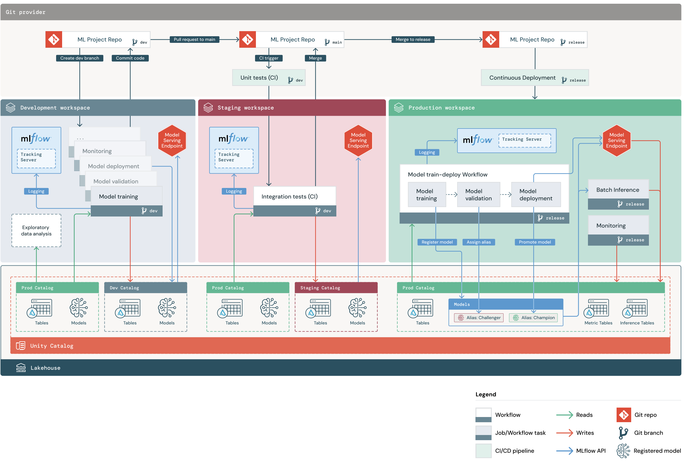

# my-monorepo

This directory contains an ML project based on the default
[Databricks MLOps Stacks](https://github.com/databricks/mlops-stacks),
defining a production-grade ML pipeline for automated retraining and batch inference of an ML model on tabular data.
The "Getting Started" docs can be found at https://learn.microsoft.com/azure/databricks/dev-tools/bundles/mlops-stacks.

See the full pipeline structure below. The [MLOps Stacks README](https://github.com/databricks/mlops-stacks/blob/main/Pipeline.md)
contains additional details on how ML pipelines are tested and deployed across each of the dev, staging, prod environments below.




## Code structure
This project contains the following components:

| Component                  | Description                                                                                                                                                                                                                                                                                                                                             |
|----------------------------|---------------------------------------------------------------------------------------------------------------------------------------------------------------------------------------------------------------------------------------------------------------------------------------------------------------------------------------------------------|
| CI/CD                      | [Azure DevOps Pipelines](https://learn.microsoft.com/en-us/azure/devops/pipelines) to test and deploy ML code and resources      |

contained in the following files:

```
my-monorepo        <- Root directory. Both monorepo and polyrepo are supported.
│
│
├── .azure                      <- Configuration folder for CI/CD using Azure DevOps Pipelines. 
│
├── docs                        <- Contains documentation for the repo.
│
├── cicd.tar.gz                 <- Contains CI/CD bundle that should be deployed by deploy-cicd.yml to set up CI/CD for projects.
```

## Using this repo

The table below links to detailed docs explaining how to use this repo for different use cases.

 

When you're ready to deploy production training/inference
pipelines, ask your ops team to follow the [MLOps setup guide](docs/mlops-setup.md) to configure CI/CD and deploy 
production ML pipelines.

After that, follow the [ML pull request guide](docs/ml-pull-request.md)
 to propose, test, and deploy changes to production ML code (e.g. update model parameters)
or pipeline resources (e.g. use a larger instance type for model training) via pull request.

| Role                          | Goal                                                                         | Docs                                                                                                                                                                |
|-------------------------------|------------------------------------------------------------------------------|---------------------------------------------------------------------------------------------------------------------------------------------------------------------|
| Data Scientist                | Get started writing ML code for a brand new project                          |  README when project is initialized |
| MLOps / DevOps                | Set up CI/CD for the current ML project   | [MLOps setup guide](docs/mlops-setup.md)                                                                                                                            |
| Data Scientist                | Update production ML code (e.g. model training logic) for an existing project | [ML pull request guide](docs/ml-pull-request.md)                                                                                                                    |
| Data Scientist                | Modify production model ML resources, e.g. model training or inference jobs  |  ML resources README when project is initialized  |

## Setting up CI/CD
This stack comes with a workflow to set up CI/CD for projects that can be found in

`.azure/devops-pipelines/deploy-cicd.yml`.


To set up CI/CD for projects that were created through MLOps Stacks with the `Project_Only` parameter, 
run the above mentioned workflow, specifying the `project_name` as a parameter. For example, for the monorepo case:

1. Setup your repository by initializing MLOps Stacks via Databricks CLI with the `CICD_and_Project` or `CICD_Only` parameter.
2. Follow the [MLOps Setup Guide](./docs/mlops-setup.md) to setup authentication and get the repo ready for CI/CD.
3. Create a new project by initializing MLOps Stacks again but this time with the `Project_Only` parameter.
4. Run the `deploy-cicd.yml` workflow with the `project_name` parameter set to the name of the project you want to set up CI/CD for.

